# Python-requests库 学习笔记

***说明：***

*1.本文章记录requests库学习笔记，会持续更新。目前学习的版本是2.24.0*

*2.requests库中有很多同名的方法，例如会有很多request()方法，所以我在代码截图中有行号，可以快速找到对应的代码。*


requests库中文网：

[Requests: 让 HTTP 服务人类 — Requests 2.18.1 文档 (python-requests.org)](https://link.zhihu.com/?target=https%3A//docs.python-requests.org/zh_CN/latest/)

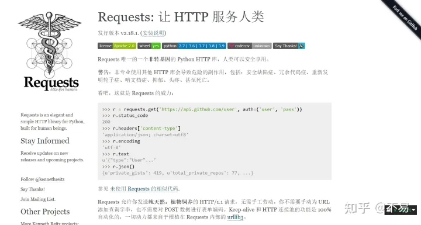

## 功能特性

Requests 完全满足今日 web 的需求。

- Keep-Alive & 连接池
- 国际化域名和 URL
- 带持久 Cookie 的会话
- 浏览器式的 SSL 认证
- 自动内容解码
- 基本/摘要式的身份认证
- 优雅的 key/value Cookie
- 自动解压
- Unicode 响应体
- HTTP(S) 代理支持
- 文件分块上传
- 流下载
- 连接超时
- 分块请求
- 支持 `.netrc`


**测试tips：可以用** [http://http](https://link.zhihu.com/?target=http%3A//httpbin.org/)[bin.org/](https://link.zhihu.com/?target=http%3A//bin.org/) 这个网站**作为测试网站学习http接口**


打开python的Lib\site-packages\requests目录，可以看到库中的文件

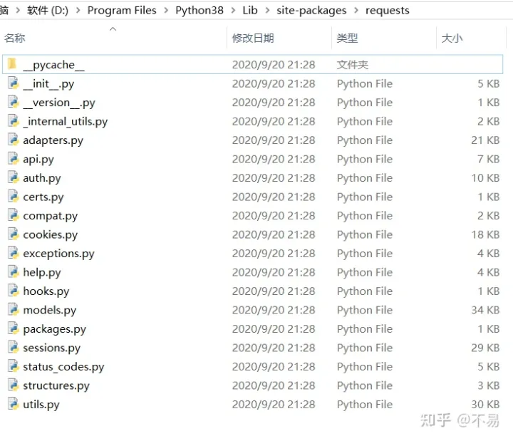


用pycharm打开后

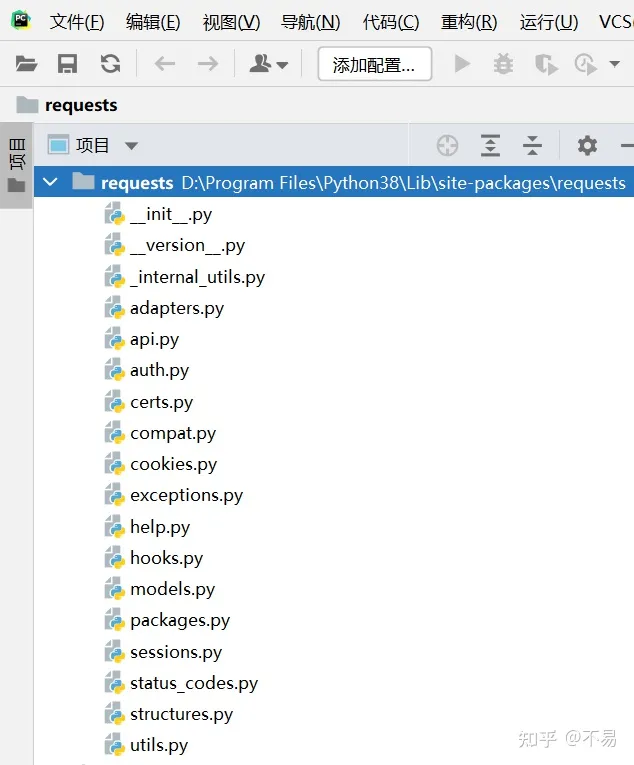

## __version__.py

__*version*__.py文件中记录了requests库的标题、作者、版本等信息。

```python3
__title__ = 'requests'
__description__ = 'Python HTTP for Humans.'
__url__ = 'https://requests.readthedocs.io'
__version__ = '2.24.0'
__build__ = 0x022400
__author__ = 'Kenneth Reitz'
__author_email__ = 'me@kennethreitz.org'
__license__ = 'Apache 2.0'
__copyright__ = 'Copyright 2020 Kenneth Reitz'
__cake__ = u'\u2728 \U0001f370 \u2728'
```

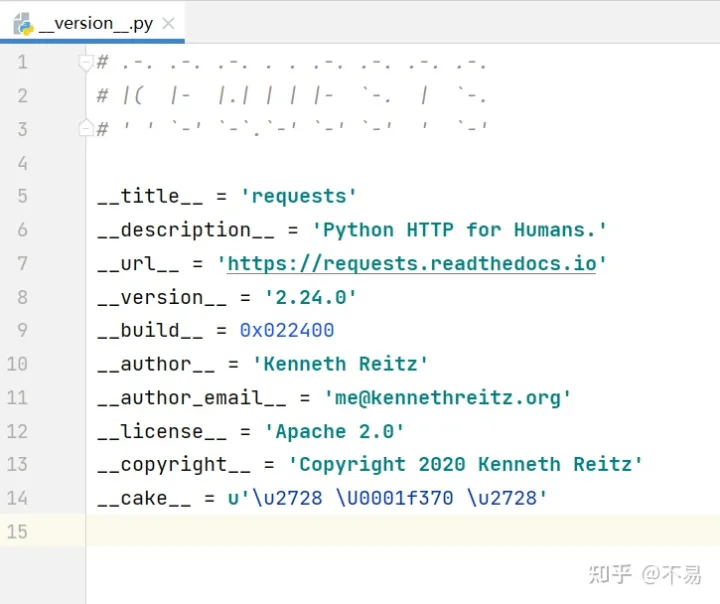

## __*init*__.py


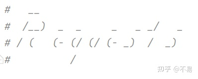

没看懂这个是什么，应该第一个是R，所以猜想应该是"Requests"

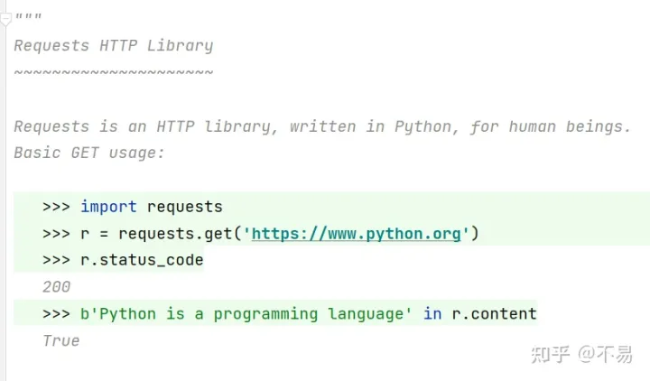

Requests库开头说明：

*Requests is an HTTP library, written in Python, for human beings.*

Requests是一个用Python编写HTTP库，供人类使用。

不得不佩服requests库真的很强大，是最好用的http库，没有之一。

get方法使用示例：

```text
   >>> import requests
   >>> r = requests.get('https://www.python.org')
   >>> r.status_code
   200
   >>> b'Python is a programming language' in r.content
   True
```

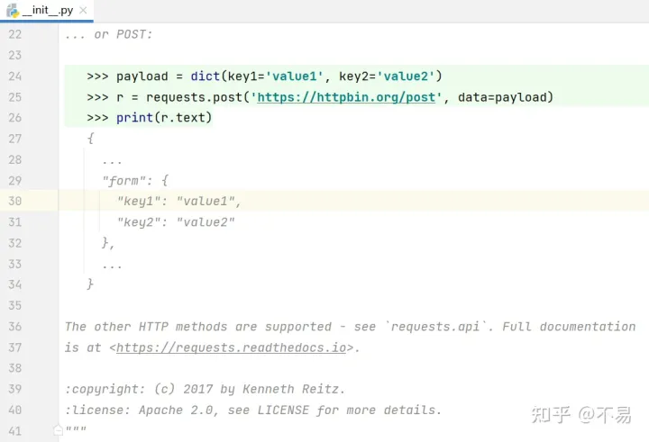

post方法使用示例：

```text
   >>> payload = dict(key1='value1', key2='value2')
   >>> r = requests.post('https://httpbin.org/post', data=payload)
   >>> print(r.text)
   {
     ...
     "form": {
       "key1": "value1",
       "key2": "value2"
     },
     ...
   }
```

The other HTTP methods are supported - see `requests.api`. Full documentation is at <[https://requests.readthedocs.io](https://link.zhihu.com/?target=https%3A//requests.readthedocs.io/)>.

**其它方法参考requests.api**

至41行，介绍了requests库，举例说明get、post方法的使用方法。


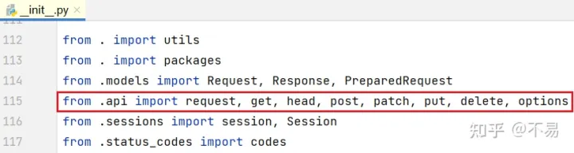

在115行导入了api.py文件中的request、get、options、head、post、put、patch、delete方法，所以可以直接通过 **requests.请求方法()** 的方式调用封装好的方法。


打开api.py文件

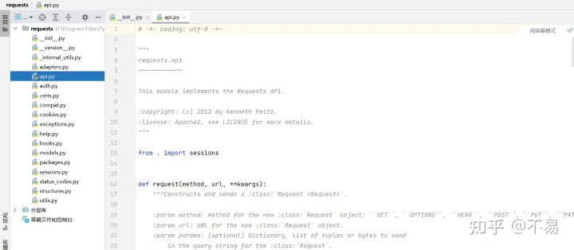

把注释去掉以后，只有这么几行代码，其中最重要的是request方法

```text
from . import sessions

def request(method, url, **kwargs):
    with sessions.Session() as session:
        return session.request(method=method, url=url, **kwargs)
```

下面就是已经封装好的http方法，包括get、options、head、post、put、patch、delete方法

```text
def get(url, params=None, **kwargs):
    kwargs.setdefault('allow_redirects', True)
    return request('get', url, params=params, **kwargs)

def options(url, **kwargs):
    kwargs.setdefault('allow_redirects', True)
    return request('options', url, **kwargs)

def head(url, **kwargs):
    kwargs.setdefault('allow_redirects', False)
    return request('head', url, **kwargs)

def post(url, data=None, json=None, **kwargs):
    return request('post', url, data=data, json=json, **kwargs)

def put(url, data=None, **kwargs):
    return request('put', url, data=data, **kwargs)

def patch(url, data=None, **kwargs):
    return request('patch', url, data=data, **kwargs)

def delete(url, **kwargs):
    return request('delete', url, **kwargs)
```

其中get、options、head方法中，多了一行代码，post、put、patch、delete方法没有这一步

```text
kwargs.setdefault('allow_redirects', True)
```

所有的方法都调用request()方法，传入**method、url、\**kwargs**三个参数

```text
def request(method, url, **kwargs):
    with sessions.Session() as session:
        return session.request(method=method, url=url, **kwargs)
```


## sessions.py

打开sessions.py文件，找到Session类

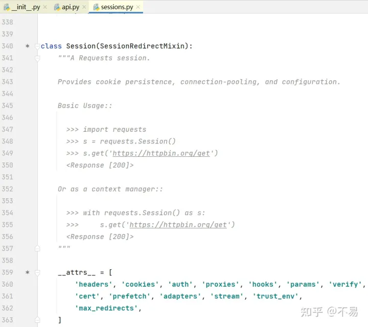

这里也写了请求的示例，可以通过创建session对象后，调用对应的方法发送请求。学习完这部分可以知道

**例如发送get请求，共有4种写法：**

1.使用request方法

```text
req = requests.request('GET', 'https://httpbin.org/get')
```

2.直接使用封装好的get方法

```text
req = requests.get('https://httpbin.org/get')
```

3.先创建session对象，再调用get方法

```text
s = requests.Session()
s.get('https://httpbin.org/get')
```

4.使用with

```text
with requests.Session() as s:
     s.get('https://httpbin.org/get')
```


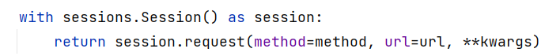

使用Session()类创建对象时使用了with，所以在Session()类加入了**__enter**__方法和**__exit__**方法

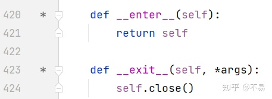

```text
    def __enter__(self):
        return self

    def __exit__(self, *args):
        self.close()
```

在**__exit__**方法中有close()方法，用于在发送请求后关闭所有适配器并关闭会话。

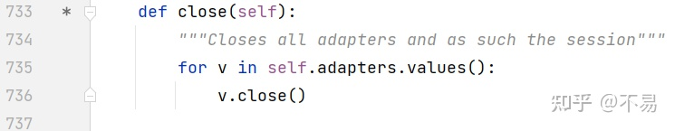


整个requests库中最核心的方法就是sessions.py文件Session类中的request方法

```text
def request(self, method, url,
            params=None, data=None, headers=None, cookies=None, files=None,
            auth=None, timeout=None, allow_redirects=True, proxies=None,
            hooks=None, stream=None, verify=None, cert=None, json=None):  
 
        # Create the Request.
        req = Request(
            method=method.upper(),
            url=url,
            headers=headers,
            files=files,
            data=data or {},
            json=json,
            params=params or {},
            auth=auth,
            cookies=cookies,
            hooks=hooks,
        )
        prep = self.prepare_request(req)
        proxies = proxies or {}
        settings = self.merge_environment_settings(prep.url, proxies, stream, verify, cert)

        # Send the request.
        send_kwargs = {'timeout': timeout, 'allow_redirects': allow_redirects,}
        send_kwargs.update(settings)
        resp = self.send(prep, **send_kwargs)
        return resp
```

可以简单分为4大步骤：

1.创建Request对象

2.准备Http请求

3.发送Http请求

4.处理Http响应


创建Request对象

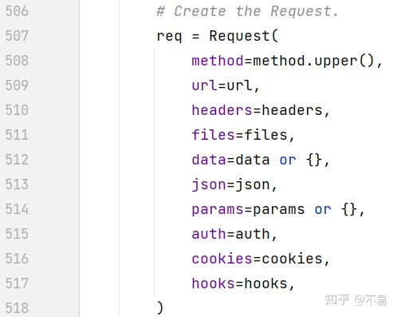

## models.py

进入Request类中（models.py文件中）

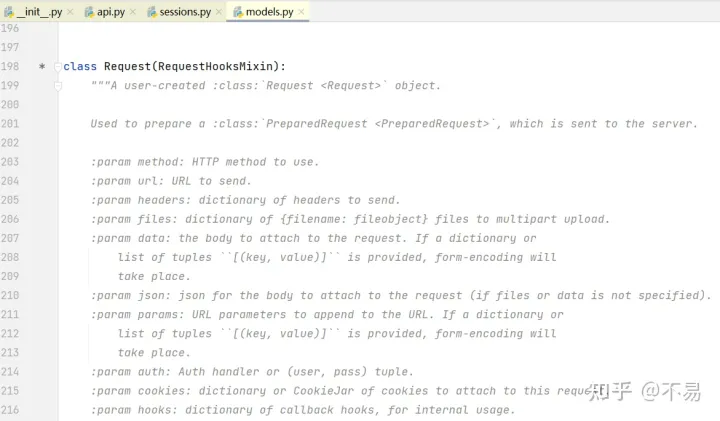

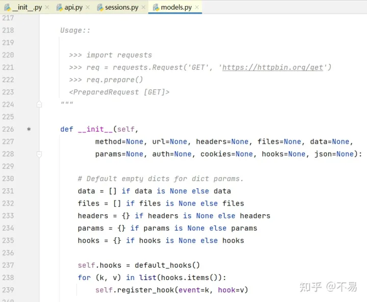

除了__init_()*和*___repr_()方法外，只有一个**prepare()**方法

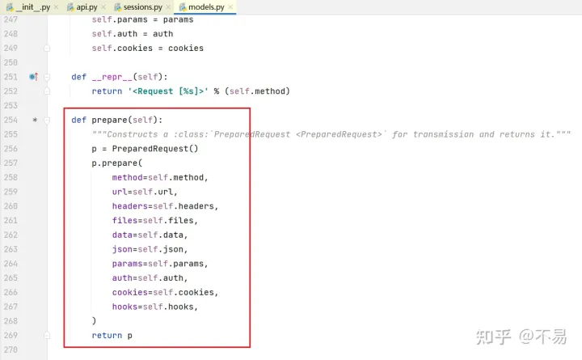

再跳转至PreparedRequest类中

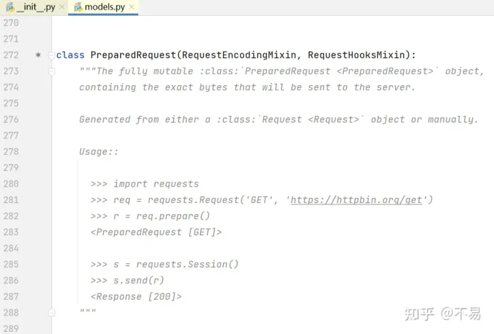

这里又写了另一种发送get请求的方式：先使用Request类的prepare()方法对请求报文进行初始化，再通过Session()的send()方法发送请求

```text
req = requests.Request('GET', 'https://httpbin.org/get')
r = req.prepare()
s = requests.Session()
s.send(r)
```

prepare()方法中有初始化多种请求报文、method，url、header、cookies等方法

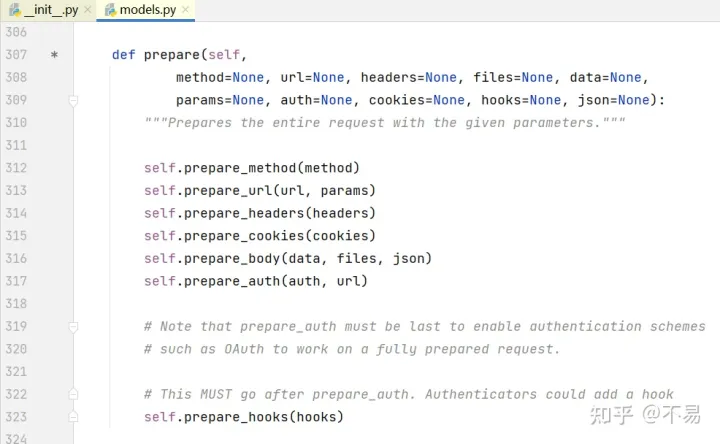

首先是初始化HTTP请求方式prepare_method()

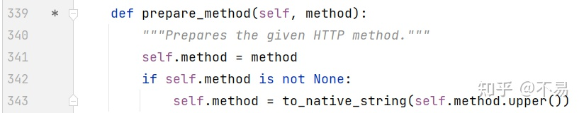

将method转为大写后，判断python版本是2还是3后，做对应的编码、解码处理

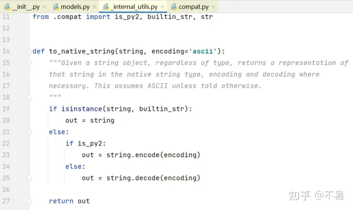

### prepare_url()

初始化url

```text
    def prepare_url(self, url, params):

        if isinstance(url, bytes):
            url = url.decode('utf8')
        else:
            url = unicode(url) if is_py2 else str(url)

        # Remove leading whitespaces from url
        url = url.lstrip()

        # Don't do any URL preparation for non-HTTP schemes like `mailto`,
        # `data` etc to work around exceptions from `url_parse`, which
        # handles RFC 3986 only.
        if ':' in url and not url.lower().startswith('http'):
            self.url = url
            return

        # Support for unicode domain names and paths.
        try:
            scheme, auth, host, port, path, query, fragment = parse_url(url)
        except LocationParseError as e:
            raise InvalidURL(*e.args)

        if not scheme:
            error = ("Invalid URL {0!r}: No schema supplied. Perhaps you meant http://{0}?")
            error = error.format(to_native_string(url, 'utf8'))

            raise MissingSchema(error)

        if not host:
            raise InvalidURL("Invalid URL %r: No host supplied" % url)

        # In general, we want to try IDNA encoding the hostname if the string contains
        # non-ASCII characters. This allows users to automatically get the correct IDNA
        # behaviour. For strings containing only ASCII characters, we need to also verify
        # it doesn't start with a wildcard (*), before allowing the unencoded hostname.
        if not unicode_is_ascii(host):
            try:
                host = self._get_idna_encoded_host(host)
            except UnicodeError:
                raise InvalidURL('URL has an invalid label.')
        elif host.startswith(u'*'):
            raise InvalidURL('URL has an invalid label.')

        # Carefully reconstruct the network location
        netloc = auth or ''
        if netloc:
            netloc += '@'
        netloc += host
        if port:
            netloc += ':' + str(port)

        # Bare domains aren't valid URLs.
        if not path:
            path = '/'

        if is_py2:
            if isinstance(scheme, str):
                scheme = scheme.encode('utf-8')
            if isinstance(netloc, str):
                netloc = netloc.encode('utf-8')
            if isinstance(path, str):
                path = path.encode('utf-8')
            if isinstance(query, str):
                query = query.encode('utf-8')
            if isinstance(fragment, str):
                fragment = fragment.encode('utf-8')

        if isinstance(params, (str, bytes)):
            params = to_native_string(params)

        enc_params = self._encode_params(params)
        if enc_params:
            if query:
                query = '%s&%s' % (query, enc_params)
            else:
                query = enc_params

        url = requote_uri(urlunparse([scheme, netloc, path, None, query, fragment]))
        self.url = url
```

首先对url进行编码处理，再删除url左边的空格

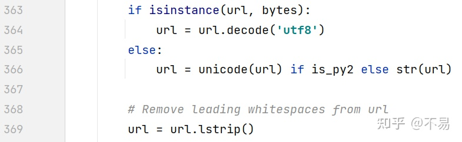

判断如果不是http开头的请求，不需要对url做处理，直接return

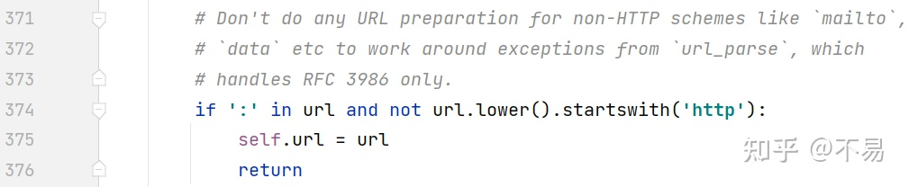

如果url中有port端口，则在host后面加上":"再加port端口

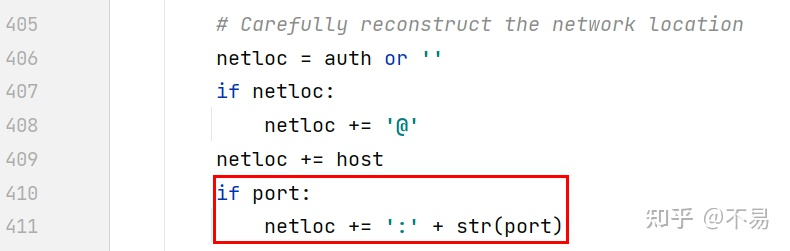

如果path为None，则path设为 '/'

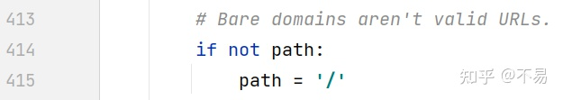

在urllib3的request.py文件中request_encode_url(）对url和请求参数进行处理

```text
    def request(self, method, url, fields=None, headers=None, **urlopen_kw):
        """
        Make a request using :meth:`urlopen` with the appropriate encoding of
        ``fields`` based on the ``method`` used.

        This is a convenience method that requires the least amount of manual
        effort. It can be used in most situations, while still having the
        option to drop down to more specific methods when necessary, such as
        :meth:`request_encode_url`, :meth:`request_encode_body`,
        or even the lowest level :meth:`urlopen`.
        """
        method = method.upper()

        urlopen_kw["request_url"] = url

        if method in self._encode_url_methods:
            return self.request_encode_url(
                method, url, fields=fields, headers=headers, **urlopen_kw
            )
        else:
            return self.request_encode_body(
                method, url, fields=fields, headers=headers, **urlopen_kw
            )
```

request_encode_url()

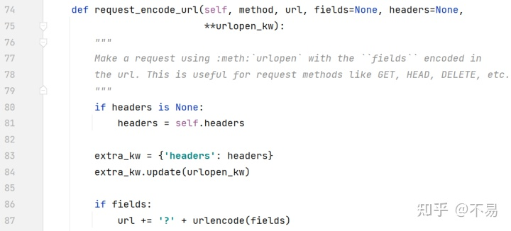

```text
    def request_encode_url(self, method, url, fields=None, headers=None, **urlopen_kw):
        """
        Make a request using :meth:`urlopen` with the ``fields`` encoded in
        the url. This is useful for request methods like GET, HEAD, DELETE, etc.
        """
        if headers is None:
            headers = self.headers

        extra_kw = {"headers": headers}
        extra_kw.update(urlopen_kw)

        if fields:
            url += "?" + urlencode(fields)

        return self.urlopen(method, url, **extra_kw)
```

**例如在请求get方法时，就可以填入url、params，不用再加“？”进行拼接**


### prepare_headers()

初始化headers

```text
    def prepare_headers(self, headers):
        """Prepares the given HTTP headers."""

        self.headers = CaseInsensitiveDict()
        if headers:
            for header in headers.items():
                # Raise exception on invalid header value.
                check_header_validity(header)
                name, value = header
                self.headers[to_native_string(name)] = value
```

### prepare_cookies()

初始化headers中的cookie

```text
    def prepare_cookies(self, cookies):
        """Prepares the given HTTP cookie data."""

        if isinstance(cookies, cookielib.CookieJar):
            self._cookies = cookies
        else:
            self._cookies = cookiejar_from_dict(cookies)
        cookie_header = get_cookie_header(self._cookies, self)
        if cookie_header is not None:
            self.headers['Cookie'] = cookie_header
```

### prepare_body()

初始化请求报文

```text
    def prepare_body(self, data, files, json=None):
        """Prepares the given HTTP body data."""

        # Check if file, fo, generator, iterator.
        # If not, run through normal process.

        # Nottin' on you.
        body = None
        content_type = None

        if not data and json is not None:
            # urllib3 requires a bytes-like body. Python 2's json.dumps
            # provides this natively, but Python 3 gives a Unicode string.
            content_type = 'application/json'
            body = complexjson.dumps(json)
            if not isinstance(body, bytes):
                body = body.encode('utf-8')

        is_stream = all([
            hasattr(data, '__iter__'),
            not isinstance(data, (basestring, list, tuple, Mapping))
        ])

        if is_stream:
            try:
                length = super_len(data)
            except (TypeError, AttributeError, UnsupportedOperation):
                length = None

            body = data

            if getattr(body, 'tell', None) is not None:
                # Record the current file position before reading.
                # This will allow us to rewind a file in the event
                # of a redirect.
                try:
                    self._body_position = body.tell()
                except (IOError, OSError):
                    # This differentiates from None, allowing us to catch
                    # a failed `tell()` later when trying to rewind the body
                    self._body_position = object()

            if files:
                raise NotImplementedError('Streamed bodies and files are mutually exclusive.')

            if length:
                self.headers['Content-Length'] = builtin_str(length)
            else:
                self.headers['Transfer-Encoding'] = 'chunked'
        else:
            # Multi-part file uploads.
            if files:
                (body, content_type) = self._encode_files(files, data)
            else:
                if data:
                    body = self._encode_params(data)
                    if isinstance(data, basestring) or hasattr(data, 'read'):
                        content_type = None
                    else:
                        content_type = 'application/x-www-form-urlencoded'

            self.prepare_content_length(body)

            # Add content-type if it wasn't explicitly provided.
            if content_type and ('content-type' not in self.headers):
                self.headers['Content-Type'] = content_type

        self.body = body
```

判断参数data、json不为空，设置headers中的“content_type”值为**'application/json'**，并且将json格式的数据转换为字典。因为python3中的字符编码为Unicode，所以需要转为'utf-8'

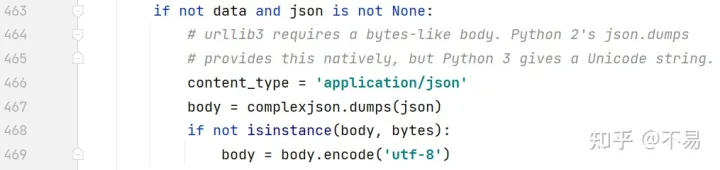

例如在发送post请求时，使用data参数

```text
req_data = {'req_data': 123}
requests.post(url, data=json.dumps(req_data))
```

直接使用json参数，不需要先把body转为json字符串再传入参数，requests库已经做了数据处理的

```text
requests.post(url, json=req_data)
```

### prepare_auth()

初始化鉴权数据

```text
    def prepare_auth(self, auth, url=''):
        """Prepares the given HTTP auth data."""

        # If no Auth is explicitly provided, extract it from the URL first.
        if auth is None:
            url_auth = get_auth_from_url(self.url)
            auth = url_auth if any(url_auth) else None

        if auth:
            if isinstance(auth, tuple) and len(auth) == 2:
                # special-case basic HTTP auth
                auth = HTTPBasicAuth(*auth)

            # Allow auth to make its changes.
            r = auth(self)

            # Update self to reflect the auth changes.
            self.__dict__.update(r.__dict__)

            # Recompute Content-Length
            self.prepare_content_length(self.body)
```

### prepare_hooks()

初始化钩子

```text
    def prepare_hooks(self, hooks):
        """Prepares the given hooks."""
        # hooks can be passed as None to the prepare method and to this
        # method. To prevent iterating over None, simply use an empty list
        # if hooks is False-y
        hooks = hooks or []
        for event in hooks:
            self.register_hook(event, hooks[event])
```

## hooks.py

在hooks.py文件中，定义了钩子函数

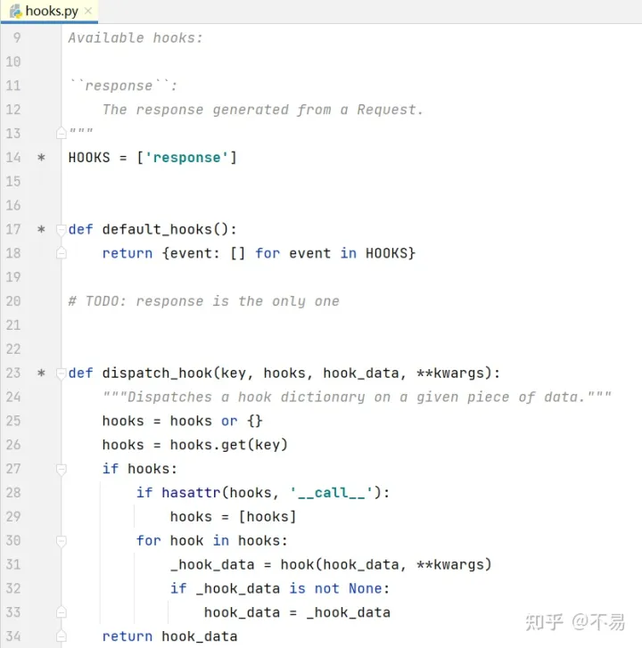


hooks钩子函数能够很方便的帮助我们进行接口测试

```text
# 钩子函数1
def no_change_url(r, *args, **kwargs):
    print("no_change_url: " + r.url)
    return r

# 钩子函数2
def change_url(r, *args, **kwargs):
    r.url = 'http://change.url'
    print("changed_url: " + r.url)
    return r

# tips: http://httpbin.org能够用于测试http请求和响应
url = 'http://httpbin.org/cookies'
```

不改变url

```text
response = requests.get(url, hooks=dict(response=no_change_url))
print("result_url: " + response.url)  # result_url: http://httpbin.org/
```

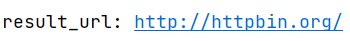

传1个url

```text
response = requests.get(url, hooks=dict(response=change_url))
print("result_url: " + response.url)  # result_url: http://change.url
```

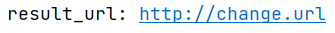

传入2个url

```text
url = 'http://httpbin.org/cookies'
response = requests.get(url, hooks=dict(response=[no_change_url, change_url]))
print("result_url: " + response.url)  # result_url: http://change.url
```

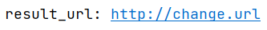

至此，完成准备Request对象，返回prep

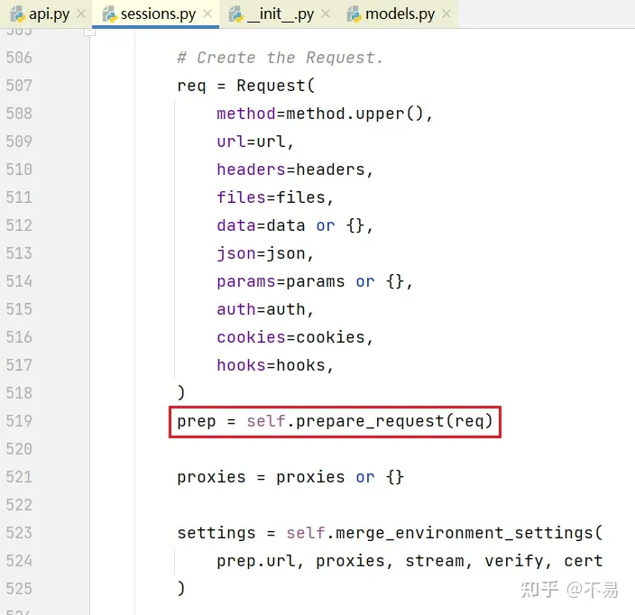

合并环境设置（包括url、proxies代理、steam、verify、cert）后，通过settings参数传入send方法中

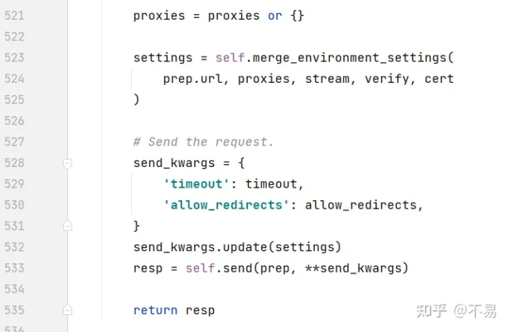

进入**send()**方法中

首先设置钩子可以使用的默认值，以确保它们总是拥有正确的参数来重现前一个请求。

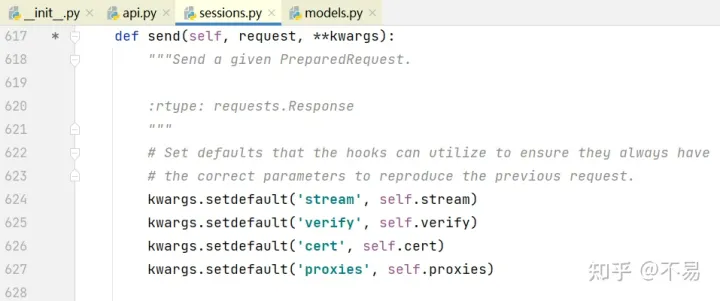

用户可能不小心发送了一个Request对象。要防范特定的失败案例。也就是说不能发送一个Request对象，只能发送**PreparedRequests**对象

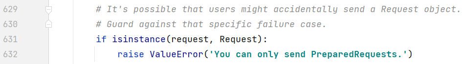


设置resolve_redirects和钩子调度所需的变量

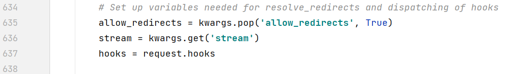

获取调度器后，发送请求，同时还记录了 **start 请求大概的开始时间 和 elapsed 请求大概的总运行时间**

elapsed 请求大概的总运行时间 = 结束时间 - start请求开始时间

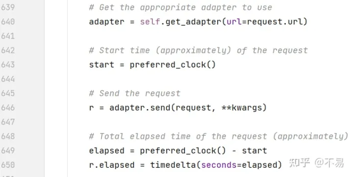

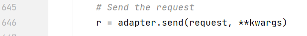

## adapters.py

进入**adapter.send()**方法（adapters.py文件的HTTPAdapter类中）

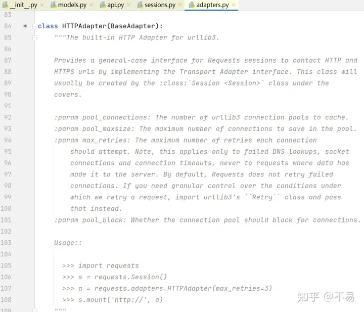

发送PreparedRequest对象。返回响应对象。

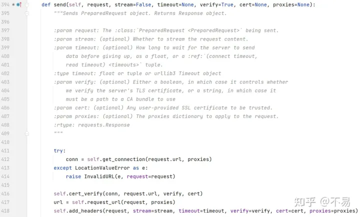

发送请求

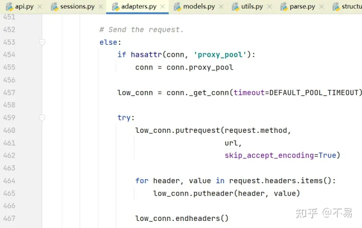

## exceptions.py文件

requests库中定义了很多Http异常方法

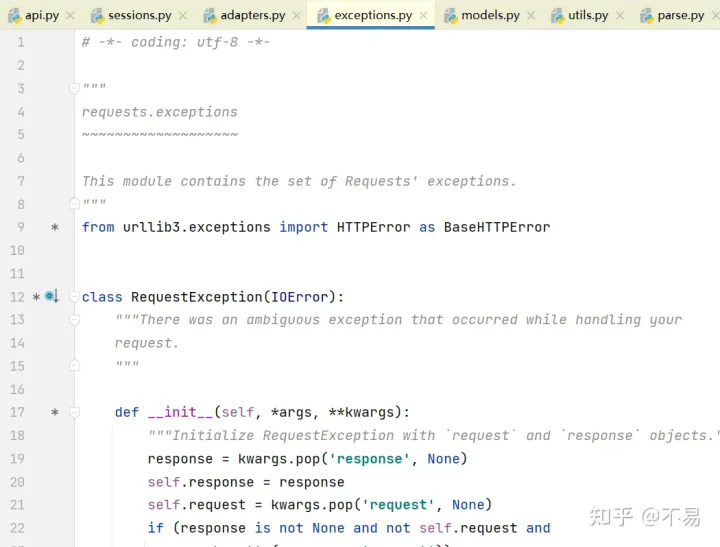


在发送请求过程中如果有错误可捕获到具体的异常

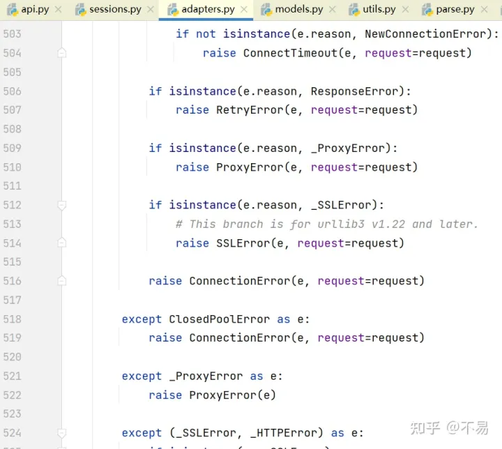

最后返回构造好的response对象

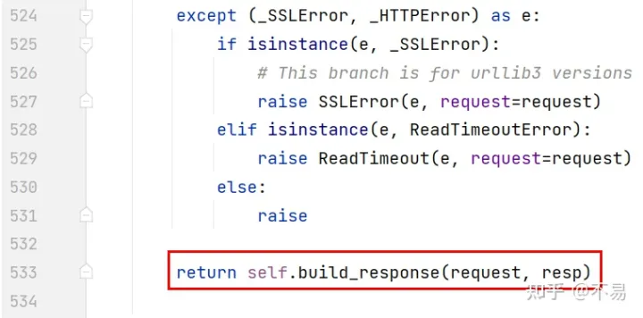

**build_response()方法**

从urllib3构建：class：`Response<requests.Response>`对象回应。这不应从用户代码中调用，并且仅公开的子类化时使用

```text
    def build_response(self, req, resp):
        """Builds a :class:`Response <requests.Response>` object from a urllib3
        response. This should not be called from user code, and is only exposed
        for use when subclassing the
        :class:`HTTPAdapter <requests.adapters.HTTPAdapter>`

        :param req: The :class:`PreparedRequest <PreparedRequest>` used to generate the response.
        :param resp: The urllib3 response object.
        :rtype: requests.Response
        """
        response = Response()

        # Fallback to None if there's no status_code, for whatever reason.
        response.status_code = getattr(resp, 'status', None)

        # Make headers case-insensitive.
        response.headers = CaseInsensitiveDict(getattr(resp, 'headers', {}))

        # Set encoding.
        response.encoding = get_encoding_from_headers(response.headers)
        response.raw = resp
        response.reason = response.raw.reason

        if isinstance(req.url, bytes):
            response.url = req.url.decode('utf-8')
        else:
            response.url = req.url

        # Add new cookies from the server.
        extract_cookies_to_jar(response.cookies, req, resp)

        # Give the Response some context.
        response.request = req
        response.connection = self

        return response
```


处理响应报文的hooks钩子

```text
        # Response manipulation hooks
        r = dispatch_hook('response', hooks, r, **kwargs)

        # Persist cookies
        if r.history:
            # If the hooks create history then we want those cookies too
            for resp in r.history:
                extract_cookies_to_jar(self.cookies, resp.request, resp.raw)

        extract_cookies_to_jar(self.cookies, request, r.raw)

        # Redirect resolving generator.
        gen = self.resolve_redirects(r, request, **kwargs)

        # Resolve redirects if allowed.
        history = [resp for resp in gen] if allow_redirects else []

        # Shuffle things around if there's history.
        if history:
            # Insert the first (original) request at the start
            history.insert(0, r)
            # Get the last request made
            r = history.pop()
            r.history = history

        # If redirects aren't being followed, store the response on the Request for Response.next().
        if not allow_redirects:
            try:
                r._next = next(self.resolve_redirects(r, request, yield_requests=True, **kwargs))
            except StopIteration:
                pass

        if not stream:
            r.content

        return r
```

判断如果不是响应报文不是数据流，调用响应报文的content属性（在Response类中），最后返回response

至此，send()方法结束，request请求完成


再看send()方法中调用的build_response方法中，使用了response对象，查看Response类

## models.py文件中Response类

该类中封装了对response响应报文处理的方法，常用的属性和方法有url、status_code、content、text、json()

示例：

```text
import requests

url = 'http://httpbin.org/post'
resp = requests.post(url)
print(resp.status_code)  # http状态码
print(resp.content)  # 返回bytes型的二进制数据
print(resp.text)  # 返回unicode型的文本数据
print(resp.json())  # 字典型的数据
print(resp.url)  # 请求的url
```

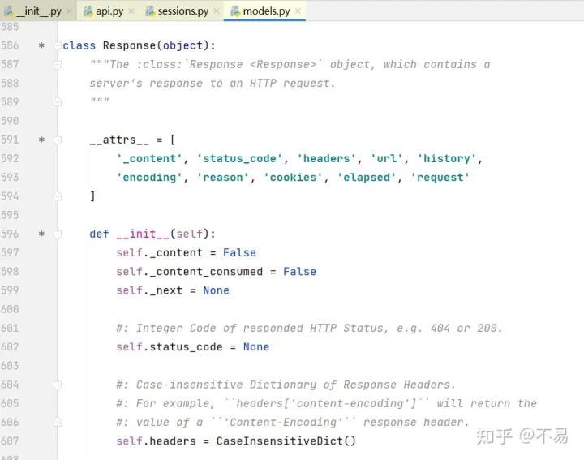

使用pycharm编辑时，可以看到提供的方法和属性

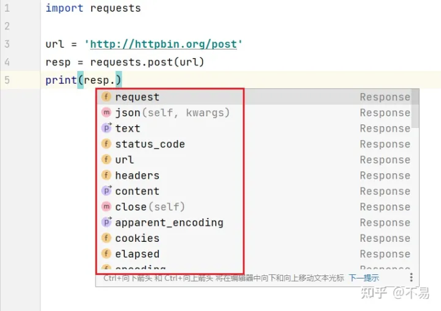

### content属性

在send方法中调用的content属性

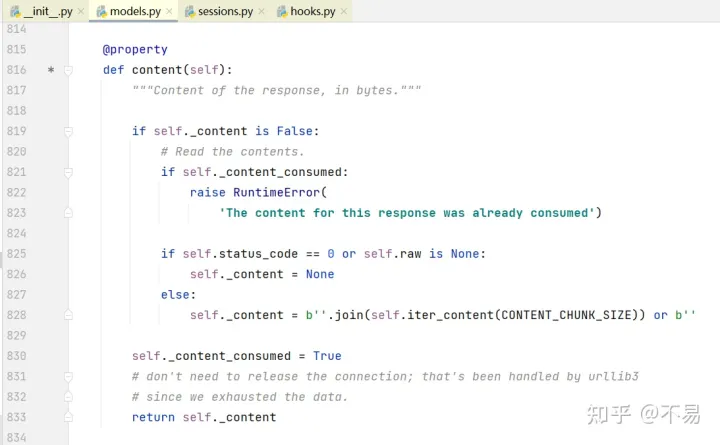

在Response类中，初始化self._content、self._content_consumed值为False

判断content是否已经被读取

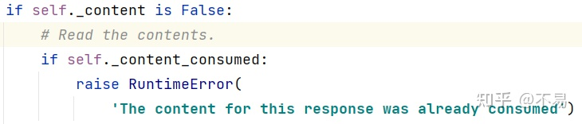

判断http响应报文的status_code状态码为0或者raw响应体为None，将content设为None；否则对响应进行遍历并解码后返回响应报文

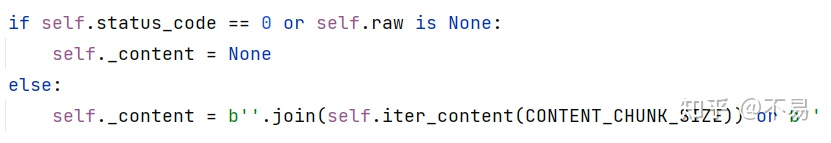

其中用到 **iter_content()**方法

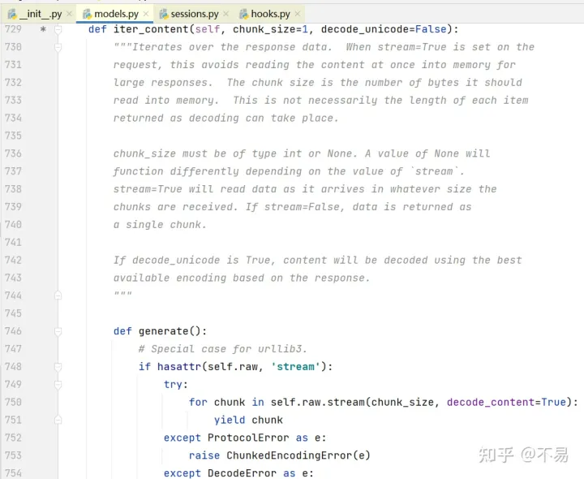

迭代响应数据。当请求上设置了STREAM=True时，这避免了针对大型响应将内容一次读取到内存中。区块大小是它应该读取到内存中的字节数。这不一定是每个项目返回的长度，因为可以进行解码。CHUNK_SIZE必须是int或None类型。如果值为None，则根据`stream`的值，其功能会有所不同。Stream=True将在数据到达时读取数据，无论收到块的大小如何。如果stream=false，则将数据作为单个区块返回。如果decode_unicode为True，则将根据响应使用最佳可用编码对内容进行解码。

最后返回bytes型的二进制数据


### text属性

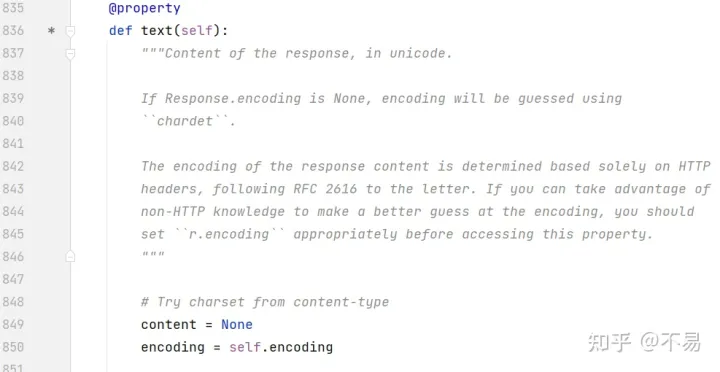

```text
    @property
    def text(self):
        """Content of the response, in unicode."""

        # Try charset from content-type
        content = None
        encoding = self.encoding

        if not self.content:
            return str('')

        # Fallback to auto-detected encoding.
        if self.encoding is None:
            encoding = self.apparent_encoding

        # Decode unicode from given encoding.
        try:
            content = str(self.content, encoding, errors='replace')
        except (LookupError, TypeError):
            content = str(self.content, errors='replace')

        return content
```

### json()

```text
    def json(self, **kwargs):
        r"""Returns the json-encoded content of a response, if any."""
        if not self.encoding and self.content and len(self.content) > 3:
            encoding = guess_json_utf(self.content)
            if encoding is not None:
                try:
                    return complexjson.loads(
                        self.content.decode(encoding), **kwargs
                    )
                except UnicodeDecodeError:
                    pass
        return complexjson.loads(self.text, **kwargs)
```

该方法可以将json格式的数据转换为字典格式的数据，所以在处理响应报文时，不需要再导入json包后使用loads()方法转换格式

示例：

```text
import requests
import json

url = 'http://httpbin.org/post'
resp = requests.post(url)
response = resp.content
print(json.loads(response))
```

直接使用json()方法

```text
import requests

url = 'http://httpbin.org/post'
resp = requests.post(url)
print(resp.json())
```

tips: requests库里面的导入json库取了别名为**complexjson**

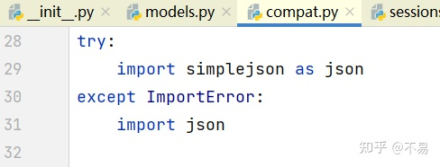

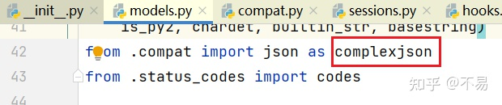

### raise_for_status()方法

对reason进行解码处理后，判断响应http状态码

如果在400~500之间，则为客户端异常

如果在500~600直接，则为服务器异常

也就是状态码在400~600则报错**HTTPError**

```text
    def raise_for_status(self):
        """Raises :class:`HTTPError`, if one occurred."""

        http_error_msg = ''
        if isinstance(self.reason, bytes):
            try:
                reason = self.reason.decode('utf-8')
            except UnicodeDecodeError:
                reason = self.reason.decode('iso-8859-1')
        else:
            reason = self.reason

        if 400 <= self.status_code < 500:
            http_error_msg = u'%s Client Error: %s for url: %s' % (self.status_code, reason, self.url)
        elif 500 <= self.status_code < 600:
            http_error_msg = u'%s Server Error: %s for url: %s' % (self.status_code, reason, self.url)

        if http_error_msg:
            raise HTTPError(http_error_msg, response=self)
```


## 结语

经过本次学习，对伟大的requests库的主要类及方法有了初步认识，还有很多方法没搞懂，以后会继续学习并持续更新该文章。库中的很多方法，对我目前TCP接口项目的代码重构工作提供了很多有用的思路，希望将脚本级别的代码构建成方便、高效的库，不断提高代码编写能力。

最后，感谢伟大的Requests库，感谢Python!